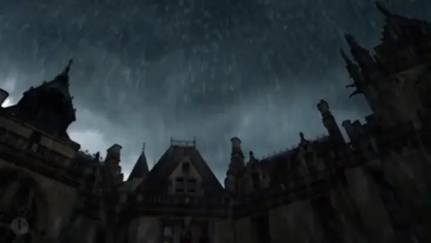

<h1 align="center"></h1>

<p align="center">
    
</p>
<h1 align="center">ghastlypale's cave</h1>

<p align="center"><i>There is no light in the void...</i></p>

```console
$ whoami
ghastlypale
$ ls -a
.   ..   logs/   projects/   notes/   archive/
$ cat archive/README.txt
Everything is connected.
$ exit
Session closed.
```
[](https://github.com/kittinan/spotify-github-profile)
<h1 align="center"></h1>
